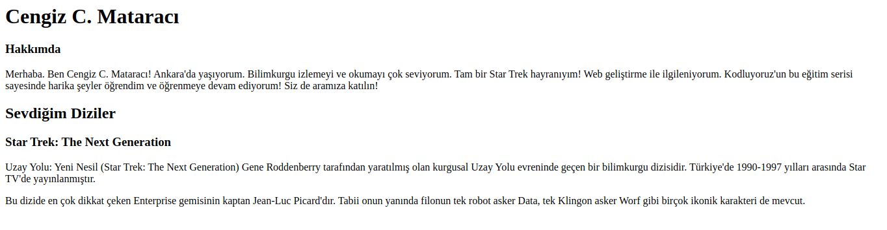

# Patika.dev Başlangıç Seviye Frontend Web Development Patikası Ödevleri

1. patika_html_odev1  
Burada sadece HTML kullanılarak basit bir web sayfası tasarlanmıştır. Görseldeki örneğe benzetilmesi istenmiştir.

---------------------------------------------------------
2. patika_html_odev2  
Burada sadece HTML kullanılarak oluşturulan web sayfasın tasarımı detaylandırıldı. Görseldeki örneğe benzetilmesi istenmiştir.

---------------------------------------------------------
3. patika_html_odev3  
Bu ödevimizde sevdiğimiz bir yemek ya da tatlının tarifini öğrendiğimiz bir web sitesini, HTML etiketlerini kullanarak yazmaya çalıştık.
---------------------------------------------------------
4. patika_html_bolumsonu  
Burada HTML eğitimi süresince öğrenilen tüm kodlamalar kullanılarak bir proje geliştirilmiştir.
---------------------------------------------------------
5. patika_css_odev1  
Burada sadece HTML ve CSS kullanılarak basit bir film arşivi örneği yapılmıştır.
---------------------------------------------------------
6. patika_css_odev2  
Burada sadece HTML ve CSS kullanılarak 1998 yılı Google anasayfası örneği yapılmıştır.

---------------------------------------------------------
7. patika_css_odev3  
Burada sadece HTML ve CSS kullanılarak günümüz Google anasayfası örneği yapılmıştır.

---------------------------------------------------------